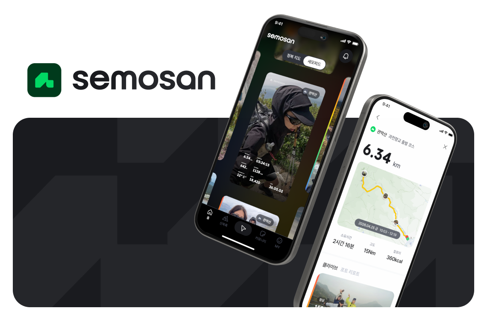
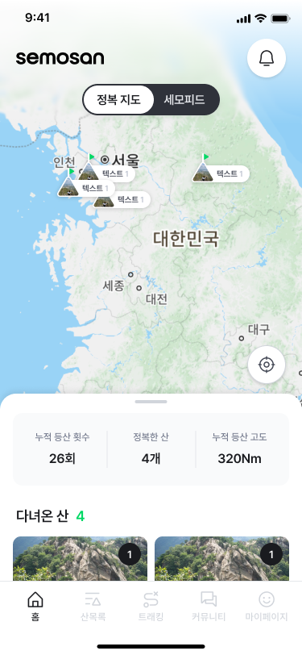
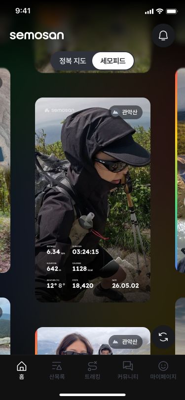
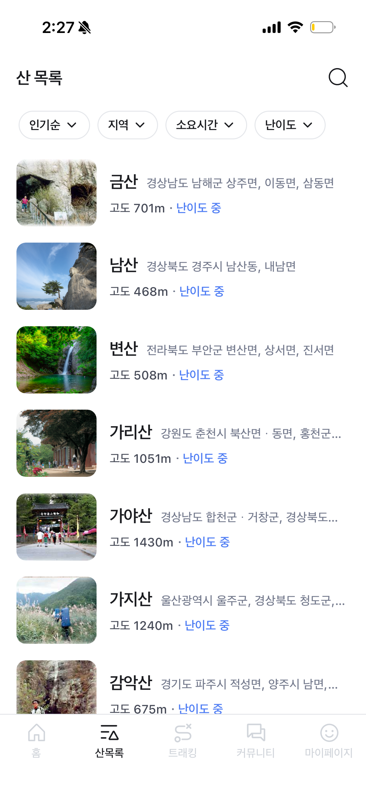
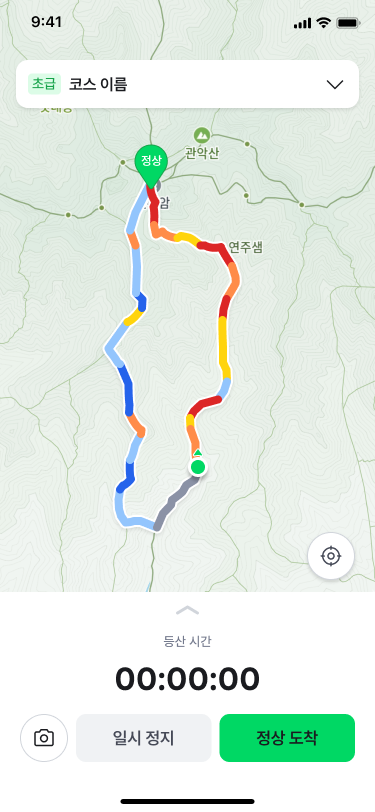
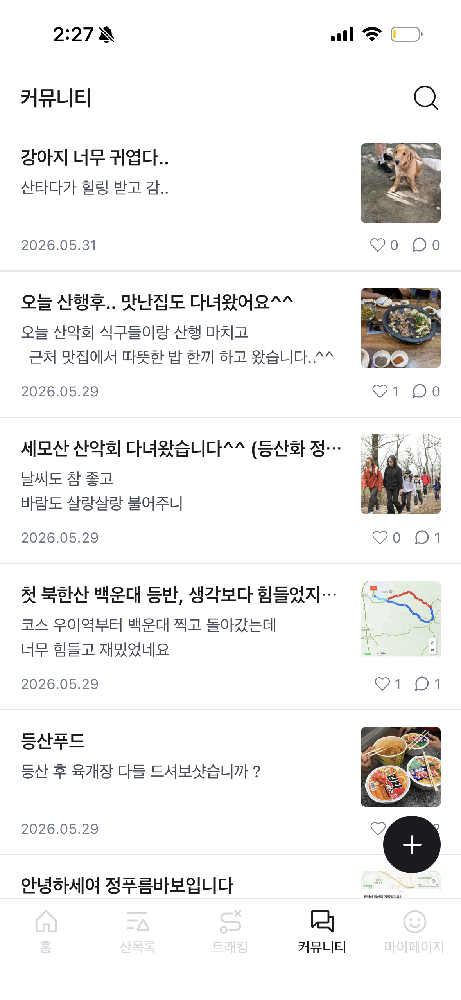
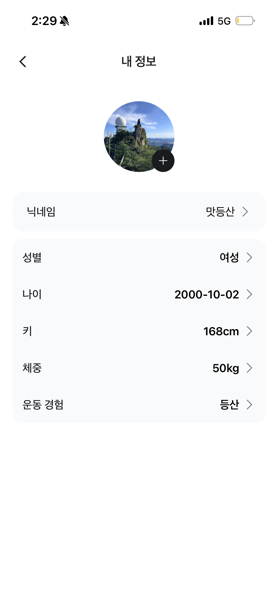

# SEMOSAN - 세모산 Backend



<br />

> 등산이 처음이어도 괜찮아요.
> 내 체력과 취향에 맞는 코스를 찾고, 실시간 안내와 기록, 후기까지
> 더 가볍고 안전한 등산을 세모산과 함께 시작하세요.

<br />

## Architecture


<br />

## API Docs

| 구분 | URL |
|------|-----|
| Swagger UI | `http://localhost:8080/swagger-ui.html` |
| Health Check | `http://localhost:9090/actuator/health` |
| Prometheus | `http://localhost:9090/actuator/prometheus` |

<br />

## 주요 기능

<table>
  <tr>
    <td align="center" width="33%">
      
      <br /><br />
      <b>정복 지도</b>
      <br />
      <sub>사용자의 등산 기록과 정복한 산 데이터 제공</sub>
    </td>
    <td align="center" width="33%">
      
      <br /><br />
      <b>세모피드</b>
      <br />
      <sub>등산 후기 피드, 이모지 반응, 알림 API 제공</sub>
    </td>
    <td align="center" width="33%">
      
      <br /><br />
      <b>산 목록</b>
      <br />
      <sub>산/코스 조회, 거리, 고도, 소요 시간 데이터 제공</sub>
    </td>
  </tr>
  <tr>
    <td align="center" width="33%">
      
      <br /><br />
      <b>실시간 GPS 트래킹</b>
      <br />
      <sub>WebSocket 기반 위치 수집 및 트래킹 세션 관리</sub>
    </td>
    <td align="center" width="33%">
      
      <br /><br />
      <b>커뮤니티</b>
      <br />
      <sub>게시글, 댓글, 좋아요, 신고, 차단 기능 제공</sub>
    </td>
    <td align="center" width="33%">
      
      <br /><br />
      <b>마이페이지</b>
      <br />
      <sub>회원 정보, 등산 이력, 난이도 피드백 관리</sub>
    </td>
  </tr>
</table>

<br />

## 기술 스택

### Backend
- **Java 21**
- **Spring Boot 4.1.0**
- **Spring Web MVC** - REST API
- **Spring Security** - 인증/인가
- **Spring Data JPA** - ORM
- **Spring Validation** - 요청 검증

### Database & Storage
- **PostgreSQL**
- **PostGIS** - 위치/공간 데이터 처리
- **Flyway** - DB 마이그레이션
- **Redis** - 캐시 및 트래킹 스트림
- **MinIO** - 이미지 객체 스토리지

### 인증 & 외부 연동
- **Kakao OAuth**
- **JWT** (`jjwt`)
- **Firebase Admin SDK** - FCM 푸시 알림
- **Spring WebFlux WebClient** - 외부 API 호출

### 실시간 & 모니터링
- **Spring WebSocket** + **STOMP** - 실시간 GPS 데이터 수신
- **Spring Boot Actuator**
- **Prometheus**
- **Logstash Logback Encoder** - Loki 연동용 JSON 로그

### API 문서
- **Springdoc OpenAPI / Swagger UI**

<br />

## 프로젝트 구조

```text
src/main/java/com/semosan/api/
  ApiApplication.java
  common/                 # 공통 설정, 응답, 예외, JWT, FCM, Discord 에러 알림(alert), 날씨 API 연동(weather)
  domain/
    admin/                # 관리자 인증, 산 관리, 커뮤니티 관리
    appversion/           # 앱 버전 관리
    auth/                 # 인증, 회원 탈퇴 정리
    oauth/                # 카카오 OAuth 연동
    user/                 # 회원, 온보딩, 차단
    mountain/             # 산/코스 조회, 코스 좋아요
    tracking/             # GPS 트래킹, WebSocket, 스케줄러
    hiking/               # 등산 기록, 난이도 피드백
    semofeed/             # 세모피드, 이모지, 알림
    community/            # 게시글, 댓글, 좋아요, 신고, 알림
    notification/         # 앱 알림
    image/                # 이미지 업로드
    review/               # 리뷰 도메인

src/main/resources/
  application.yaml        # 공통 설정
  application-local.yaml  # 로컬 프로필 설정
  application-prod.yaml   # 운영 프로필 설정
  db/migration/           # Flyway 마이그레이션
  firebase/               # Firebase 서비스 계정 파일

k8s/                      # Kubernetes 배포 리소스
.github/workflows/        # GitHub Actions
```

<br />

## 시작하기

### 요구사항

- Java 21
- PostgreSQL + PostGIS
- Redis
- MinIO
- Gradle Wrapper 사용 권장

### 설치

```bash
git clone https://github.com/SEMOSAN/SEMOSAN_BE.git
cd SEMOSAN_BE
```

### 로컬 실행

로컬 프로필은 기본값으로 활성화됩니다.

```bash
./gradlew bootRun
```

### 테스트

```bash
./gradlew test
```

특정 테스트만 실행할 때는 다음 형식을 사용합니다.

```bash
./gradlew test --tests com.semosan.api.domain.mountain.service.MountainServiceTest
```

`./gradlew check` 실행 시 Jacoco 커버리지 검증이 함께 수행되며, 전체 라인 커버리지가 **90% 미만이면 빌드가 실패**합니다.

<br />

## CI/CD

GitHub Actions로 테스트와 배포를 자동화합니다.

| 워크플로우 | 트리거 | 내용 |
|-----------|--------|------|
| `test.yml` | `develop`, `main` 대상 PR | PostGIS·Redis·MinIO 서비스 컨테이너 기동 → `./gradlew test jacocoTestReport` 실행 → PR에 Jacoco 커버리지 코멘트(전체/변경 파일 최소 90%) |
| `deploy.yml` | `develop`, `main` push | Gradle 빌드 → Docker 이미지 빌드 후 GHCR(`ghcr.io/semosan/semosan_be`, 저장소명 소문자 변환)에 푸시 → `develop` 브랜치는 `k8s/kustomization.yaml`의 이미지 태그를 자동 커밋(ArgoCD가 감지해 배포) |

<br />

## 개발 규칙

- Java 21, Spring Boot 3.5.x 기준으로 개발합니다.
- 기능은 기존 `domain/*` 패키지 구조를 따릅니다.
- 공통 응답, 예외, 상태 코드는 `common/`의 기존 규칙을 우선 사용합니다.
- DB 스키마 변경은 `src/main/resources/db/migration/`에 Flyway 마이그레이션으로 추가합니다.
- 비즈니스 규칙, payload 생성, 검증 로직을 중복 작성하지 않습니다.
- 좁은 변경은 관련 테스트를 먼저 실행하고, 필요 시 전체 테스트를 실행합니다.
- 민감한 값은 커밋하지 않고 환경 변수 또는 배포 Secret으로 관리합니다.

<br />

## 브랜치 전략

```text
feat/#이슈번호-기능명
fix/#이슈번호-버그명
```

예시:

```text
feat/#12-mountain-search
fix/#34-trail-query-bug
```

<br />

## 커밋 컨벤션

| 타입 | 설명 |
|------|------|
| `feat` | 새로운 기능 |
| `fix` | 버그 수정 |
| `refactor` | 코드 리팩토링 |
| `docs` | 문서 수정 |
| `test` | 테스트 코드 |
| `chore` | 빌드, 설정 변경 |

예시:

```text
feat: 산 검색 API 추가
fix: 등산로 조회 쿼리 오류 수정
```

<br />

## PR 규칙

- 리뷰어: 본인 제외 **2명 전원 승인** 후 머지
- 셀프 머지 금지
